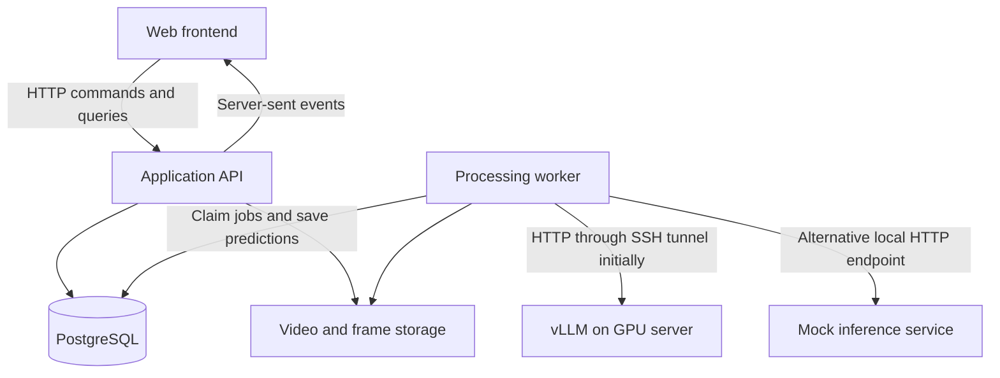

# Proposed architecture

## Components

Use one repository and a modular Python backend. API and worker share the prediction package but run as separate processes. Slow decoding and inference must not block API request handling.

The browser only talks to the application API. The worker calls vLLM's chat-completions endpoint. vLLM stays loaded between requests. No custom GPU-side application is initially planned.

Local development defaults to a separate mock HTTP service implementing the subset of the serving contract we use. The same worker HTTP client, preprocessing, prompt builder, parser, persistence, and UI run in both environments. Deployment configuration selects one endpoint; the worker does not call both. See [mock inference](mock-inference.md). Never silently fall back to mock responses when a real server fails.

## Clip analysis flow

1. API accepts and validates an upload, stores the file, and records a video asset.
2. User chooses a time range and configuration; a preprocessing preview shows the intended frames.
3. API stores an immutable resolved configuration and creates a job, returning its ID.
4. Worker claims the job, preprocesses the segment, builds the prompt, and calls vLLM.
5. Worker validates the generated label and stores result, raw output, provenance, and timing.
6. API publishes status/result events. Frontend can fetch persisted results after reconnecting.

Preview and inference must share preprocessing logic and identify the same input frames. Avoid independently sampling twice with different random offsets.

## Monitoring flow

A scheduler within the worker deployment creates timestamped window jobs for an active session. Initially it follows the playback position of a recorded source. It must not process future frames ahead of simulated live availability.

Define window interval after latency measurements; preserve approximately two-second input span for the baseline. Bound queued work per session. Initially prefer dropping expired pending windows for live monitoring, recording each skipped interval. Clip-analysis jobs should instead remain available for completion or explicit cancellation.

Persist sequence numbers and media timestamps. Out-of-order results remain in history but cannot replace a newer latest prediction. Stop, seek, or restart creates a new playback generation so old results cannot contaminate the current view. A configuration change starts a new configuration segment.

Event aggregation is a later layer over immutable window predictions. It may merge repeated fall detections; it must not rewrite original labels.

## Queue and reliability

Initially use a PostgreSQL job table rather than a separate queue service. Implementation must include atomic claiming, leases/heartbeat, bounded retries for transient failures, and idempotent result persistence. A stale lease can be reclaimed; repeated completion must not duplicate predictions. Invalid input and unparseable model output need explicit failure handling.

The API may initially read persisted job changes to publish server-sent events. The database is the source of truth, not the event connection. Reconnect uses persisted state and event/sequence identifiers.

## Storage and deployment

Start with PostgreSQL and filesystem media storage. API and worker need the same media volume when colocated. Store relative storage keys rather than machine-specific absolute paths. Keep a storage boundary for later object storage.

For ordinary local development, the worker reaches the local mock service without GPU access. For real-model integration, it reaches GPU-local vLLM through an SSH tunnel. A local worker path is not a GPU-server path: send media bytes or a deliberately accessible media URL. Verify online video transport against the research preprocessing before choosing its exact encoding.

Persistent deployment can use a private network or authenticated HTTPS endpoint. GPU sizing, network topology, exact vLLM version, and process supervision remain open.
